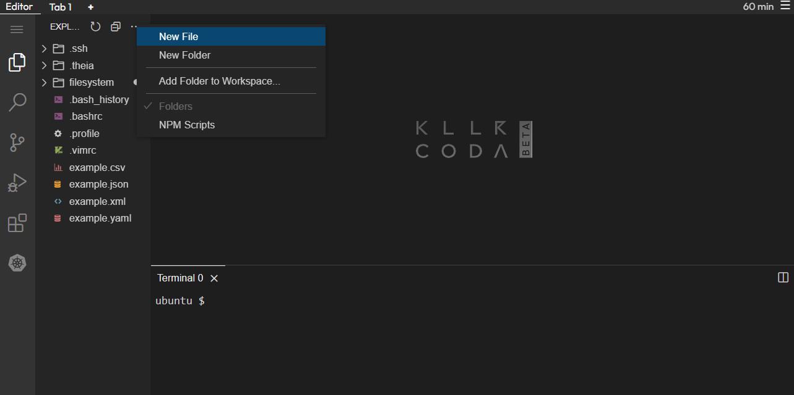
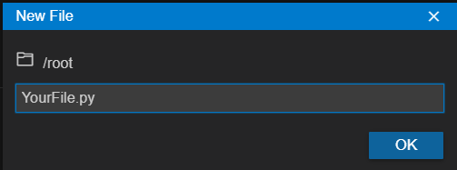
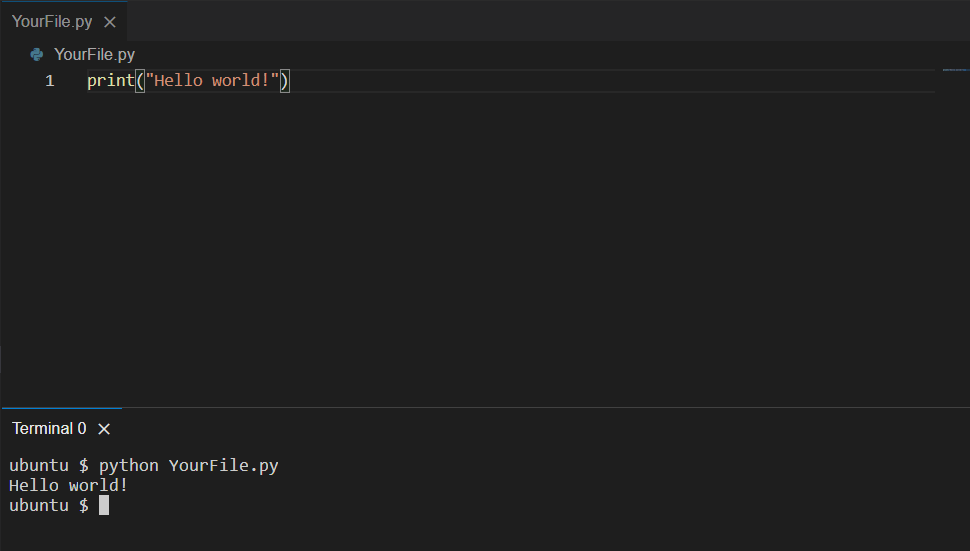
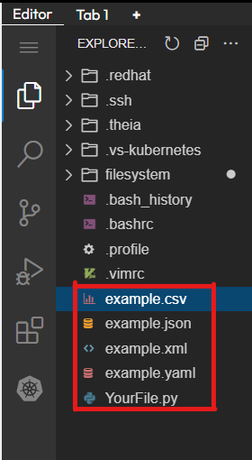
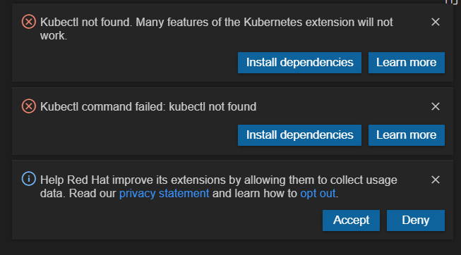

Here are some tips on how to use the platform:

- to create a new file, use the built-in editor 

- to create a file in Python, click *New File* 

- to run the command, write *python YourFile.py* in the terminal 

- on the left you can see examples of files for using commands  

- YAML files have some specific functions on this platform, 
so click **X** to close the notification when you open it 