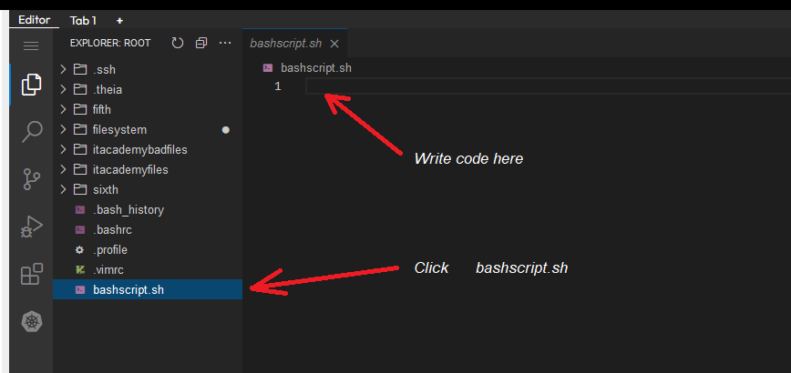

Click `bashscript.sh` 
 
Write a bash script that reads each line from the `deleteemptyfiles` file 
(filename comes as a parameter in bash script) and deletes the files
 
After that when you click `CHECK` see file `log` in main directory
 

 

